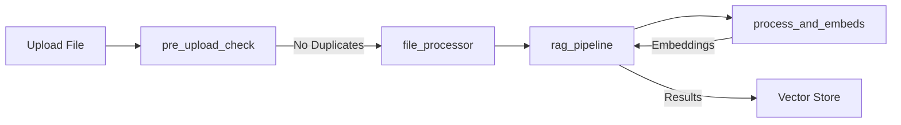

# AWS RAG (Retrieval Augmented Generation) Pipeline

A serverless document processing and retrieval pipeline built on AWS Lambda that processes documents, generates embeddings, and enables semantic search capabilities.

## Architecture Overview

The pipeline consists of four main Lambda functions that work together to process documents and enable semantic search:

1. **pre_upload_check**
   - Checks for duplicate files using filename and content similarity
   - Prevents duplicate document uploads
   - Manages file upload to S3

2. **file_processor**
   - Handles initial document processing
   - Extracts text from various file formats
   - Prepares content for embedding generation

3. **process_and_embeds**
   - Generates embeddings for processed text
   - Uses sentence transformers for embedding generation
   - Handles chunking and text preprocessing

4. **rag_pipeline**
   - Manages vector storage using FAISS
   - Handles semantic search queries
   - Orchestrates the retrieval process

## Flow Diagram



## Prerequisites

- AWS Account with appropriate permissions
- AWS CLI configured locally
- Docker installed locally
- Python 3.12

## Setup Instructions

1. **Configure AWS Credentials**
   ```bash
   aws configure
   ```

2. **Create Required AWS Resources**
   - S3 bucket for document storage
   - ECR repositories for Lambda functions
   - Lambda functions with appropriate IAM roles

3. **Deploy the Pipeline**
   ```bash
   # Make the deployment script executable
   chmod +x deploy.sh
   
   # Deploy all functions
   ./deploy.sh
   ```

## Lambda Functions Details

### pre_upload_check
- **Purpose**: Prevent duplicate document uploads
- **Input**: File content and metadata
- **Output**: Duplicate check results or success confirmation
- **Dependencies**: boto3, numpy

### file_processor
- **Purpose**: Initial document processing
- **Input**: S3 file event
- **Output**: Processed text content
- **Dependencies**: See `functions/file_processor/requirements.txt`

### process_and_embeds
- **Purpose**: Generate embeddings for text content
- **Input**: Processed text content
- **Output**: Vector embeddings
- **Dependencies**: See `functions/process_and_embeds/requirements.txt`

### rag_pipeline
- **Purpose**: Manage vector storage and retrieval
- **Input**: Search queries or new embeddings
- **Output**: Search results or storage confirmation
- **Dependencies**: See `functions/rag_pipeline/requirements.txt`

## Environment Variables

Each Lambda function requires specific environment variables:

```
S3_BUCKET=your-bucket-name
REGION=aws-region
VECTOR_DIMENSION=384  # Depends on the embedding model used
```

## Deployment

The deployment script supports both Docker-based and traditional ZIP-based Lambda deployments with automatic API Gateway integration.

### Deployment Methods

The script automatically chooses the deployment method based on the function structure:

#### Docker Deployment
- **When**: If `Dockerfile` exists in the function directory
- **Process**: Builds Docker image → Pushes to ECR → Deploys Lambda from container image
- **Benefits**: Better for functions with complex dependencies or large packages

#### ZIP Deployment
- **When**: If no `Dockerfile` found in the function directory
- **Process**: Packages function code → Installs dependencies → Creates ZIP → Deploys Lambda from ZIP
- **Benefits**: Faster deployment for simple functions

### Command Line Options

```bash
Usage: ./deploy.sh [--env dev|prod] [--function function_name]
  --env: Environment to deploy to (dev or prod)
  --function: Deploy specific function only (optional)
```

### Deployment Examples

#### Deploy All Functions
```bash
# Deploy all functions to development environment (default)
./deploy.sh

# Deploy all functions to development environment explicitly
./deploy.sh --env dev

# Deploy all functions to production environment
./deploy.sh --env prod
```

#### Deploy Specific Function
```bash
# Deploy specific function to development
./deploy.sh --env dev --function file_processor

# Deploy specific function to production
./deploy.sh --env prod --function rag_pipeline

# Deploy function with Docker (if Dockerfile exists)
./deploy.sh --env dev --function process_and_embeds

# Deploy function with ZIP (if no Dockerfile)
./deploy.sh --env dev --function pre_upload_check
```

### Environment-Based Deployment

The deployment script supports separate development and production environments:

- **Function Naming**: Functions are prefixed with environment name (e.g., `dev-file_processor`, `prod-file_processor`)
- **API Gateway**: Each function gets its own API Gateway endpoint with environment-specific naming
- **ECR Tags**: Docker images are tagged with environment names
- **Environment Variables**: Loaded from `.env` files in each function directory

### API Gateway Integration

The deployment script automatically manages API Gateway for each Lambda function:

#### Features
- **Automatic Creation**: Creates API Gateway if it doesn't exist
- **Smart Naming**: Converts function names (replaces `_` with `-` for API Gateway compatibility)
- **Skip Logic**: Skips API Gateway creation on redeployment if already exists
- **Proxy Integration**: Sets up `{proxy+}` resources for flexible routing
- **Permissions**: Automatically grants API Gateway permission to invoke Lambda

#### API Gateway URLs
After deployment, each function gets an API Gateway endpoint:
```
https://{api-id}.execute-api.{region}.amazonaws.com/{environment}
```

Example:
```
https://abc123def456.execute-api.us-east-1.amazonaws.com/dev
```

### Deployment Process

The complete deployment process includes:

1. **Function Discovery**: Scans `functions/` directory for deployable functions
2. **Environment Variables**: Loads variables from `.env` files
3. **Deployment Method Selection**: Chooses Docker or ZIP based on Dockerfile presence
4. **Code Deployment**: Updates Lambda function code using selected method
5. **API Gateway Management**: Creates or validates API Gateway endpoints
6. **Cleanup**: Removes temporary files and local Docker images

### Prerequisites for Deployment

- AWS CLI configured with appropriate permissions
- Docker installed (for Docker-based deployments)
- Python 3.12 and pip (for ZIP-based deployments)
- Required IAM permissions for:
  - Lambda function management
  - ECR repository access
  - API Gateway management
  - S3 bucket access

### Function Structure Requirements

Each function directory must contain:
- `main.py` - Main Lambda function handler
- `requirements.txt` - Python dependencies (optional)
- `Dockerfile` - For Docker deployment (optional)
- `.env` - Environment variables (optional)

### Deployment Validation

The script validates:
- Function directory existence
- Required files presence
- Environment parameter validity
- AWS credentials and permissions
- Docker availability (for Docker deployments)

## Development

To add a new function:
1. Create a new directory under `functions/`
2. Add required files:
   - `main.py`
   - `requirements.txt`
   - `Dockerfile`
3. Run `deploy.sh` to deploy

## Error Handling

The pipeline implements comprehensive error handling:
- Duplicate file detection
- Invalid file formats
- Processing failures
- Embedding generation errors

## Monitoring

Monitor the pipeline using:
- CloudWatch Logs
- Lambda metrics
- S3 event notifications

## Security

- All functions use IAM roles with least privilege
- S3 bucket encryption enabled
- Secure environment variable handling
- ECR image scanning enabled
