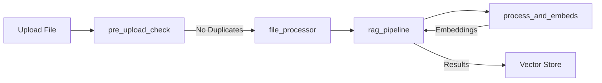

# AWS RAG (Retrieval Augmented Generation) Pipeline

A serverless document processing and retrieval pipeline built on AWS Lambda that processes documents, generates embeddings, and enables semantic search capabilities.

## Architecture Overview

The pipeline consists of four main Lambda functions that work together to process documents and enable semantic search:

1. **pre_upload_check**
   - Checks for duplicate files using filename and content similarity
   - Prevents duplicate document uploads
   - Manages file upload to S3

2. **file_processor**
   - Handles initial document processing
   - Extracts text from various file formats
   - Prepares content for embedding generation

3. **process_and_embeds**
   - Generates embeddings for processed text
   - Uses sentence transformers for embedding generation
   - Handles chunking and text preprocessing

4. **rag_pipeline**
   - Manages vector storage using FAISS
   - Handles semantic search queries
   - Orchestrates the retrieval process

## Flow Diagram



## Prerequisites

- AWS Account with appropriate permissions
- AWS CLI configured locally
- Docker installed locally
- Python 3.9+

## Setup Instructions

1. **Configure AWS Credentials**
   ```bash
   aws configure
   ```

2. **Create Required AWS Resources**
   - S3 bucket for document storage
   - ECR repositories for Lambda functions
   - Lambda functions with appropriate IAM roles

3. **Deploy the Pipeline**
   ```bash
   # Make the deployment script executable
   chmod +x deploy.sh
   
   # Deploy all functions
   ./deploy.sh
   ```

## Lambda Functions Details

### pre_upload_check
- **Purpose**: Prevent duplicate document uploads
- **Input**: File content and metadata
- **Output**: Duplicate check results or success confirmation
- **Dependencies**: boto3, numpy

### file_processor
- **Purpose**: Initial document processing
- **Input**: S3 file event
- **Output**: Processed text content
- **Dependencies**: See `functions/file_processor/requirements.txt`

### process_and_embeds
- **Purpose**: Generate embeddings for text content
- **Input**: Processed text content
- **Output**: Vector embeddings
- **Dependencies**: See `functions/process_and_embeds/requirements.txt`

### rag_pipeline
- **Purpose**: Manage vector storage and retrieval
- **Input**: Search queries or new embeddings
- **Output**: Search results or storage confirmation
- **Dependencies**: See `functions/rag_pipeline/requirements.txt`

## Environment Variables

Each Lambda function requires specific environment variables:

```
S3_BUCKET=your-bucket-name
REGION=aws-region
VECTOR_DIMENSION=384  # Depends on the embedding model used
```

## Deployment

The project uses Docker containers for Lambda deployment. Each function has its own Dockerfile and requirements.txt.

### Environment-Based Deployment

The deployment script supports separate development and production environments. Functions are automatically prefixed with the environment name (e.g., `dev-file_processor` or `prod-file_processor`).

To deploy to different environments:

```bash
# Deploy to development environment (default)
./deploy.sh

# Deploy to development environment explicitly
./deploy.sh --env dev

# Deploy to production environment
./deploy.sh --env prod
```

Key features of environment-based deployment:
- Separate Lambda functions for each environment
- Environment-specific Docker image tags
- Shared ECR repositories with environment-specific tags
- Isolated environment variables per environment
- Clear separation between development and production resources

### Deployment Process

The deployment process includes:
1. Build Docker images with environment-specific tags
2. Push to ECR
3. Update Lambda functions with environment prefixes

The `deploy.sh` script handles all these steps automatically.

## Development

To add a new function:
1. Create a new directory under `functions/`
2. Add required files:
   - `main.py`
   - `requirements.txt`
   - `Dockerfile`
3. Run `deploy.sh` to deploy

## Error Handling

The pipeline implements comprehensive error handling:
- Duplicate file detection
- Invalid file formats
- Processing failures
- Embedding generation errors

## Monitoring

Monitor the pipeline using:
- CloudWatch Logs
- Lambda metrics
- S3 event notifications

## Security

- All functions use IAM roles with least privilege
- S3 bucket encryption enabled
- Secure environment variable handling
- ECR image scanning enabled
